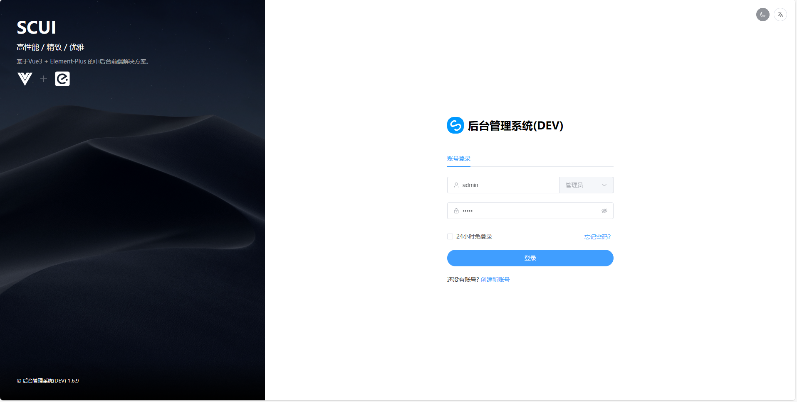
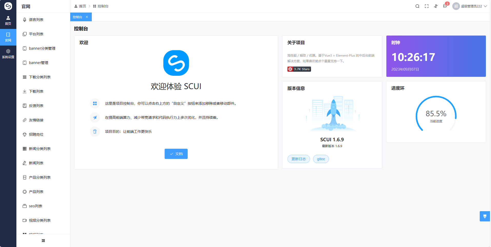
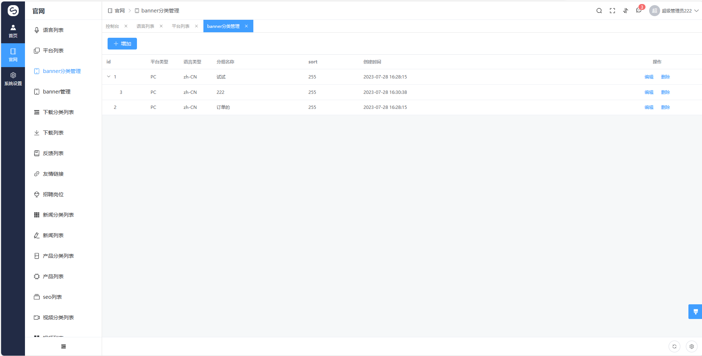
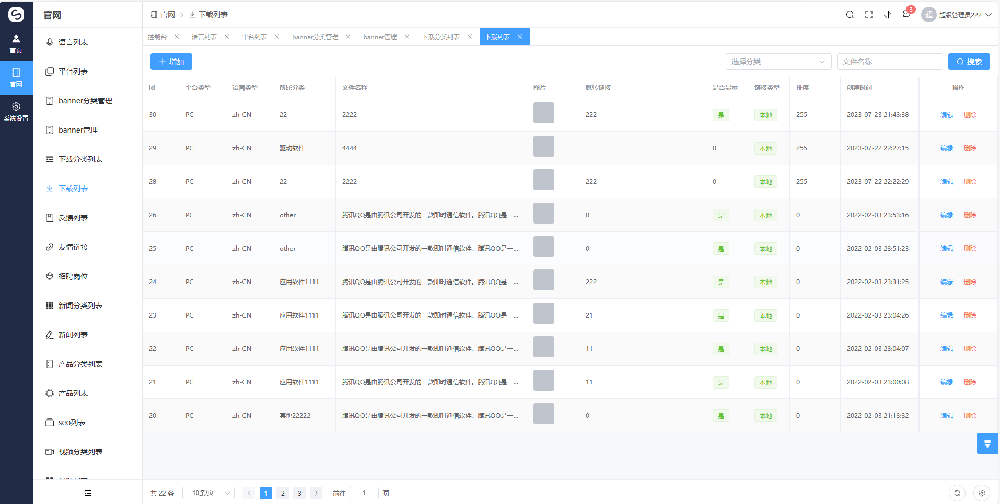
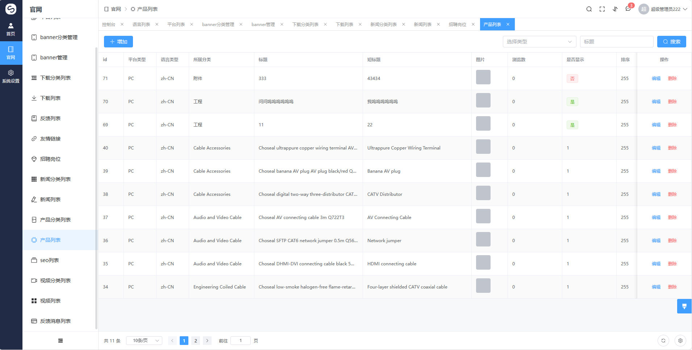
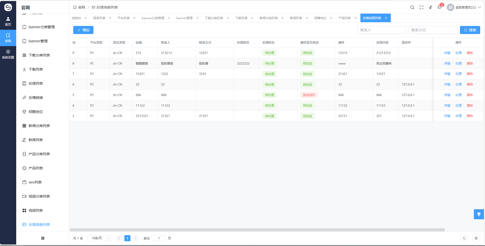
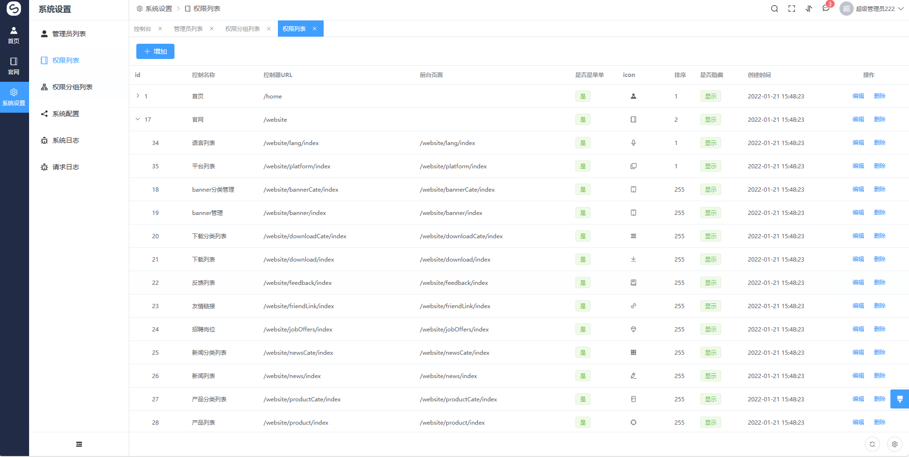
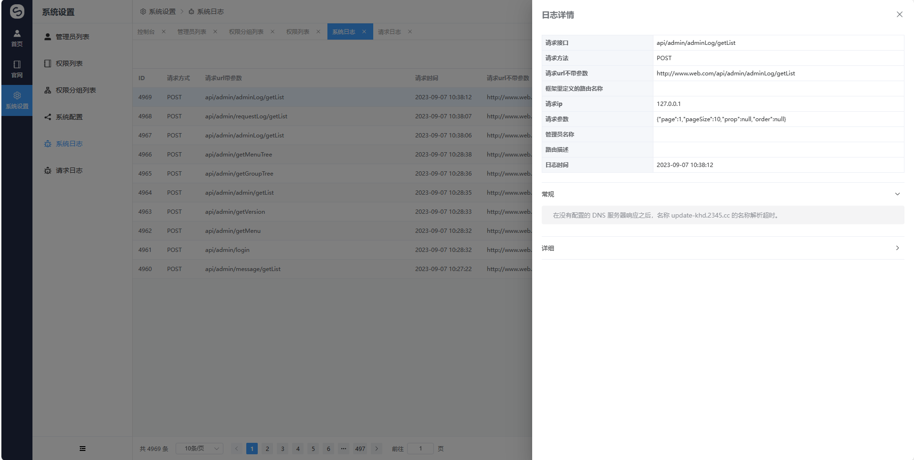

# CMS, enterprise official website general PHP management system

[中文文档](./README.md)

## Framework introduction
[Webman](https://github.com/walkor/webman)    
[SCUI](https://gitee.com/lolicode/scui)

### Back-end development component
php 8.0     
webmen 1.5.0     
composer 2

### database sql(use the latest date file)
`webman\doc\sql_bak`
mysql 8.0

### Front-end development component
scui 1.6.9      
node v14.21.3       

### effect picture

